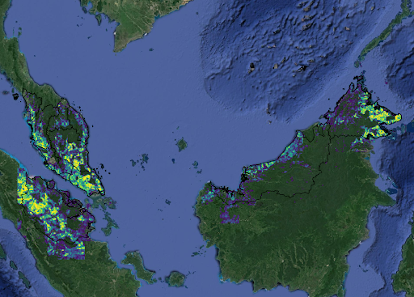

# Deep Semantic Density Estimation



Density estimation of palm and coconut trees using Sentinel-2 open source imagery.

 
## Preprocessing of Sentinel-2 and preparing ground-truth

#### Download Data from copernicus server

1. Create an account [here](https://scihub.copernicus.eu/)
2. Using the `download_sentinel.ipynb`, you can load a certain .shp file that defines the tiles you want to download.
 Manual download from website manually is also available directly from the website.

#### Level-2A products (sen2cor)

sen2cor is an algorithm that performs atmospheric corrections and scene
 classifications including clouds [(see more)](https://step.esa.int/main/third-party-plugins-2/sen2cor/).
 we base all our methods on images that have this level of processing (Level-2A)

- If the input data is newer than Dec-2018 data can be downloaded directly as a Level-2A product.
- If earlier dates are needed use `create_2A.sh` to create the Level-2A product (snap is required, see requirements).
`create_2A_array.sh` allows you to use a cluster for distributing the task over different computing nodes for parallel processing.

The expected tree directory is:

```
data
└─1C
|  └─ phillipines_2017
|  |   └─ PRODUCT
|  |      └─ S2A_MSIL1C_20170114T020411_N0204_R017_T51NYH_20170114T020453.zip
|  └─ indonesia_2017
|     ...
└─2A
   └─ phillipines_2017
   |   └─ S2A_MSIL1C_20170114T020411_N0204_R017_T51NYH_20170114T020453.SAFE
   └─ indonesia_2017
     ...  
```
Note that we only use 2A products. after processing the 1C folder can be removed.

#### Labels

Our annotation strategy is to have at least 2 annotated regions of at least 300ha for each sentinel tile (1 Mha). See LabelingCampaign.pdf for more details.

The expected tree directory is:

```
data/labels
└─palm_annotations
  └─ T47NPB
  |   └─ group1
  |      └─ points.kml
  |      └─ positive.kml
  |      └─ negative.kml
  |   └─ group2
  |      └─ ...
  └─ T47NQV
     └─ ...
 ```

Then use `OrganizeAnnotations.ipynb` to convert them to .shp files

## Training and validation

1. Example usage of `main.py` to train a model:

`python3 main.py --dataset=palmtiles --model=simpleA9`

the flat `--dataset` defines the input data where we want to train and validate on. use `data_config.py` to define tiles and specific locations where the model should take input data from and the .shp files of each tile.

## Prediction and postprocessing

#### Prediction with a trained model

1. once a model is trained use `predict.py` to predict a SAFE dataset and save it as a GeoTiff file. Use `predict_array.sh` for parallel predictions over large areas.
2. Predictions are masked with cloud values, to overcome this issue, we just aggregate all observations over all times available for each location. For such purpose use `sh aggregate_per_tile.sh` for such purpose.

## Merging toghether single prediction tiles (untiling)
Finally, use `untile.py` if you want to create a lower resolution version of a large predicted area. After merging `zonal_stats.py`
can be used to create statistics per defined (usually large scale) areas.


## Requirements python
- gdal >= 2.2.1
- sentinelsat
- pyproj
- tensorflow > 1.7.0
- jupyter-notebook 

## Requirements
- [SNAP](http://step.esa.int/main/download/) >= 5.0
- [sen2cor](http://step.esa.int/main/third-party-plugins-2/sen2cor/) 2.4.0


